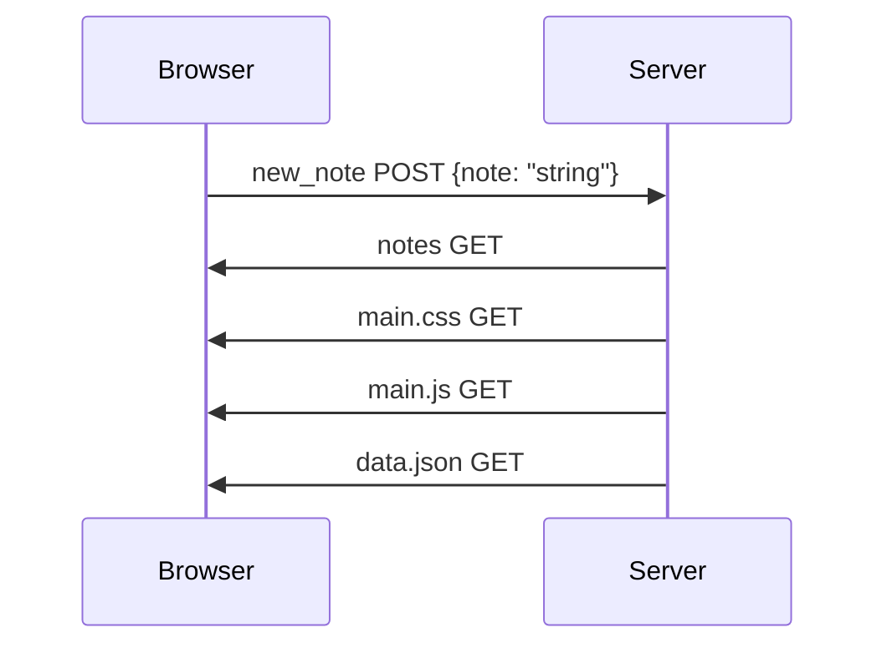
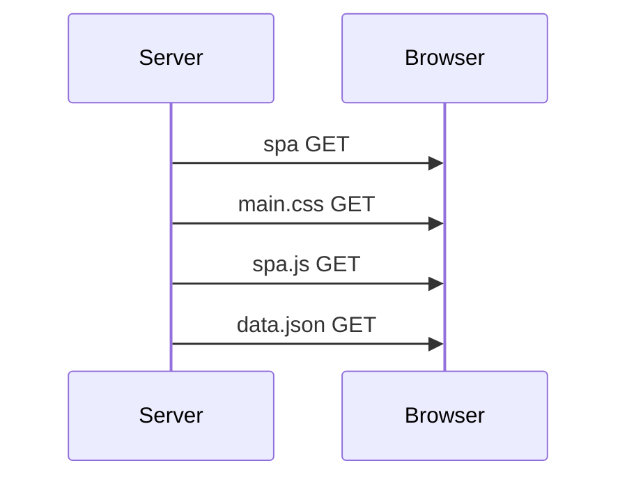
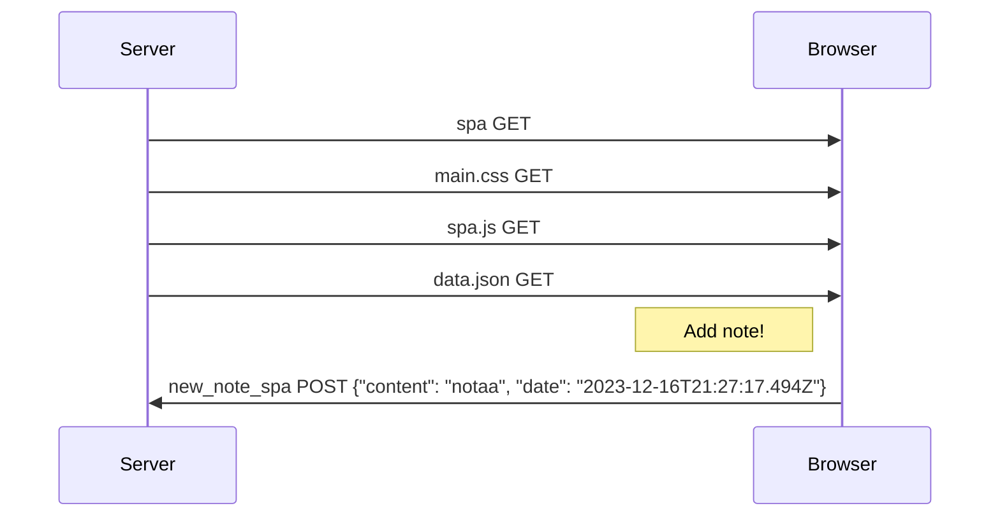

## Add note

```mermaid
sequenceDiagram
  Browser->>Server: new_note POST {note: "string"}
  Server->>Browser: notes GET
  Server->>Browser: main.css GET
  Server->>Browser: main.js GET
  Server->>Browser: data.json GET
```

## SPA

```mermaid
sequenceDiagram
Server->>Browser: spa GET
  Server->>Browser: main.css GET
  Server->>Browser: spa.js GET
  Server->>Browser: data.json GET
```

## SPA & add note

```mermaid
sequenceDiagram
Server->>Browser: spa GET
  Server->>Browser: main.css GET
  Server->>Browser: spa.js GET
  Server->>Browser: data.json GET
  Note left of Browser: Add note!
  Browser->>Server: new_note_spa POST {"content": "notaa", "date": "2023-12-16T21:27:17.494Z"}
```
